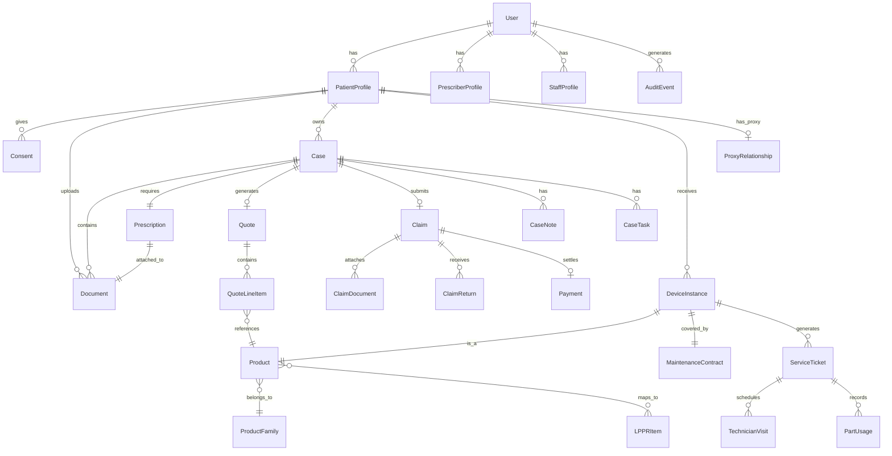

# AX TECH Wheelchair Platform — Backend Specifications

> **This document is the SOURCE OF TRUTH for the domain model.**
> All other specs (API, Frontend, AI Services) reference entities defined here.

---

## 1. Canonical Domain Model

### 1.1 Entity Relationship Diagram (Mermaid)



---

### 1.2 Entity Definitions

#### User
Core authentication entity for all user types.

| Field | Type | Required | Constraints | Description |
|-------|------|----------|-------------|-------------|
| id | UUID | Yes | PK | Unique identifier |
| email | String | Yes | Unique, valid email | Login email |
| phone | String | No | E.164 format | Mobile phone for SMS |
| passwordHash | String | Yes | bcrypt | Hashed password |
| role | Enum | Yes | PATIENT, PRESCRIBER, OPS, BILLING, TECHNICIAN, COMPLIANCE_ADMIN | Primary role |
| status | Enum | Yes | PENDING_VERIFICATION, ACTIVE, SUSPENDED, DELETED | Account status |
| emailVerified | Boolean | Yes | Default: false | Email verification status |
| phoneVerified | Boolean | Yes | Default: false | Phone verification status |
| mfaEnabled | Boolean | Yes | Default: false | MFA status (required for staff) |
| mfaSecret | String | No | Encrypted | TOTP secret |
| lastLoginAt | DateTime | No | | Last successful login |
| createdAt | DateTime | Yes | Auto | Creation timestamp |
| updatedAt | DateTime | Yes | Auto | Last update timestamp |

**Indexes**: `email` (unique), `phone` (unique, nullable), `role`, `status`

---

#### PatientProfile
Extended profile for patients.

| Field | Type | Required | Constraints | Description |
|-------|------|----------|-------------|-------------|
| id | UUID | Yes | PK | Unique identifier |
| userId | UUID | Yes | FK → User | Link to auth user |
| firstName | String | Yes | Max 100 chars | Legal first name |
| lastName | String | Yes | Max 100 chars | Legal last name |
| dateOfBirth | Date | Yes | | Birth date |
| nir | String | No | 15 digits, encrypted | French social security number |
| carteVitaleNumber | String | No | Encrypted | Carte Vitale number |
| address | JSONB | No | | Structured address object |
| mutuelle | JSONB | No | | Supplementary insurance info |
| contactPreference | Enum | Yes | EMAIL, SMS, PHONE | Preferred contact method |
| emergencyContact | JSONB | No | | Emergency contact details |
| createdAt | DateTime | Yes | Auto | |
| updatedAt | DateTime | Yes | Auto | |

**Address JSONB Schema**:
```json
{
  "line1": "string",
  "line2": "string",
  "postalCode": "string",
  "city": "string",
  "country": "string (default: FR)"
}
```

**Indexes**: `userId` (unique), `nir` (encrypted index), `lastName`, `dateOfBirth`

---

#### PrescriberProfile
Extended profile for healthcare professionals.

| Field | Type | Required | Constraints | Description |
|-------|------|----------|-------------|-------------|
| id | UUID | Yes | PK | Unique identifier |
| userId | UUID | Yes | FK → User | Link to auth user |
| rppsNumber | String | No | 11 digits | National prescriber ID |
| adeliNumber | String | No | 9 digits | ADELI identifier |
| specialty | String | No | Max 100 | Medical specialty |
| practiceName | String | No | Max 200 | Practice/hospital name |
| practiceAddress | JSONB | No | | Practice address |
| createdAt | DateTime | Yes | Auto | |
| updatedAt | DateTime | Yes | Auto | |

**Indexes**: `userId` (unique), `rppsNumber`, `adeliNumber`

---

#### StaffProfile
Extended profile for AX TECH staff.

| Field | Type | Required | Constraints | Description |
|-------|------|----------|-------------|-------------|
| id | UUID | Yes | PK | Unique identifier |
| userId | UUID | Yes | FK → User | Link to auth user |
| employeeId | String | Yes | Unique | Internal employee ID |
| department | Enum | Yes | OPS, BILLING, TECH, COMPLIANCE | Department |
| permissions | String[] | Yes | | Granular permissions array |
| managerId | UUID | No | FK → StaffProfile | Reporting manager |
| createdAt | DateTime | Yes | Auto | |
| updatedAt | DateTime | Yes | Auto | |

**Indexes**: `userId` (unique), `employeeId` (unique), `department`

---

#### ProxyRelationship
Caregiver/proxy delegation.

| Field | Type | Required | Constraints | Description |
|-------|------|----------|-------------|-------------|
| id | UUID | Yes | PK | Unique identifier |
| patientId | UUID | Yes | FK → PatientProfile | Patient being represented |
| proxyUserId | UUID | Yes | FK → User | Proxy user |
| relationship | Enum | Yes | FAMILY, SOCIAL_WORKER, NURSING_HOME, OTHER | Relationship type |
| consentDocumentId | UUID | Yes | FK → Document | Signed delegation consent |
| validFrom | DateTime | Yes | | Start of validity |
| validUntil | DateTime | No | | End of validity (null = indefinite) |
| status | Enum | Yes | ACTIVE, REVOKED, EXPIRED | |
| createdAt | DateTime | Yes | Auto | |

**Indexes**: `patientId`, `proxyUserId`, `status`

---

#### Consent
Versioned consent records.

| Field | Type | Required | Constraints | Description |
|-------|------|----------|-------------|-------------|
| id | UUID | Yes | PK | Unique identifier |
| patientId | UUID | Yes | FK → PatientProfile | Patient who consented |
| consentType | Enum | Yes | HEALTH_DATA, MARKETING, TERMS_OF_SERVICE | Type of consent |
| version | String | Yes | Semver | Consent text version |
| textHash | String | Yes | SHA-256 | Hash of consent text |
| ipAddress | String | Yes | | IP at time of consent |
| userAgent | String | Yes | | Browser/device info |
| consentedAt | DateTime | Yes | | When consent was given |
| withdrawnAt | DateTime | No | | When consent was withdrawn |

**Indexes**: `patientId`, `consentType`, `version`

---

#### Document
Uploaded files (prescriptions, IDs, etc.).

| Field | Type | Required | Constraints | Description |
|-------|------|----------|-------------|-------------|
| id | UUID | Yes | PK | Unique identifier |
| ownerId | UUID | Yes | FK → User | Uploader |
| ownerType | Enum | Yes | PATIENT, PRESCRIBER, STAFF | Owner type |
| documentType | Enum | Yes | PRESCRIPTION, ID_CARD, CARTE_VITALE, PROOF_OF_ADDRESS, QUOTE_PDF, DELIVERY_PROOF, OTHER | Document category |
| filename | String | Yes | Max 255 | Original filename |
| mimeType | String | Yes | | MIME type |
| sizeBytes | Integer | Yes | Max 50MB | File size |
| storageKey | String | Yes | | S3/storage path |
| sha256Hash | String | Yes | | Content hash |
| metadata | JSONB | No | | Extracted/OCR metadata |
| scanStatus | Enum | Yes | PENDING, CLEAN, INFECTED | Antivirus scan result |
| scanCompletedAt | DateTime | No | | When scan completed |
| createdAt | DateTime | Yes | Auto | |
| deletedAt | DateTime | No | | Soft delete timestamp |

**Indexes**: `ownerId`, `ownerType`, `documentType`, `sha256Hash`, `scanStatus`

---

#### Prescription
Medical prescription linking to document.

| Field | Type | Required | Constraints | Description |
|-------|------|----------|-------------|-------------|
| id | UUID | Yes | PK | Unique identifier |
| patientId | UUID | Yes | FK → PatientProfile | Patient |
| prescriberId | UUID | No | FK → PrescriberProfile | Prescriber (if known) |
| documentId | UUID | Yes | FK → Document | Prescription document |
| prescriptionDate | Date | Yes | | Date on prescription |
| expirationDate | Date | No | | Prescription validity end |
| productCategory | Enum | Yes | MANUAL_WHEELCHAIR, ELECTRIC_WHEELCHAIR, ACCESSORIES | Prescribed category |
| clinicalNotes | Text | No | Encrypted | Additional clinical context |
| verificationStatus | Enum | Yes | PENDING, VERIFIED, REJECTED | Staff verification |
| verifiedBy | UUID | No | FK → User | Who verified |
| verifiedAt | DateTime | No | | When verified |
| createdAt | DateTime | Yes | Auto | |

**Indexes**: `patientId`, `prescriberId`, `verificationStatus`, `prescriptionDate`

---

#### Case
Main dossier entity tracking the reimbursement workflow.

| Field | Type | Required | Constraints | Description |
|-------|------|----------|-------------|-------------|
| id | UUID | Yes | PK | Unique identifier |
| caseNumber | String | Yes | Unique, auto-generated | Human-readable case ID |
| patientId | UUID | Yes | FK → PatientProfile | Patient |
| prescriptionId | UUID | Yes | FK → Prescription | Associated prescription |
| status | Enum | Yes | See status enum | Current workflow status |
| priority | Enum | Yes | NORMAL, URGENT | Case priority |
| assignedTo | UUID | No | FK → User | Assigned ops staff |
| checklistState | JSONB | Yes | | Checklist completion state |
| slaDeadline | DateTime | No | | Target completion time |
| submittedAt | DateTime | No | | When submitted to CPAM |
| approvedAt | DateTime | No | | CPAM approval time |
| rejectedAt | DateTime | No | | CPAM rejection time |
| rejectionReason | Text | No | | Rejection explanation |
| deliveredAt | DateTime | No | | Delivery completion |
| createdAt | DateTime | Yes | Auto | |
| updatedAt | DateTime | Yes | Auto | |

**Case Status Enum**:
```
INTAKE_RECEIVED
DOCUMENTS_PENDING
DOCUMENTS_COMPLETE
UNDER_REVIEW
QUOTE_PENDING
QUOTE_READY
PATIENT_APPROVAL_PENDING
READY_TO_SUBMIT
SUBMITTED_TO_CPAM
CPAM_PENDING
CPAM_APPROVED
CPAM_REJECTED
DELIVERY_SCHEDULED
DELIVERED
MAINTENANCE_ACTIVE
CLOSED
CANCELLED
```

**Checklist State JSONB Schema**:
```json
{
  "idVerified": boolean,
  "carteVitaleVerified": boolean,
  "prescriptionVerified": boolean,
  "addressVerified": boolean,
  "productSelected": boolean,
  "quoteGenerated": boolean,
  "patientApproved": boolean
}
```

**Indexes**: `caseNumber` (unique), `patientId`, `status`, `assignedTo`, `priority`, `createdAt`

---

#### CaseNote
Internal notes on cases.

| Field | Type | Required | Constraints | Description |
|-------|------|----------|-------------|-------------|
| id | UUID | Yes | PK | Unique identifier |
| caseId | UUID | Yes | FK → Case | Parent case |
| authorId | UUID | Yes | FK → User | Note author |
| content | Text | Yes | Max 5000 chars | Note content |
| isInternal | Boolean | Yes | Default: true | Hide from patient |
| createdAt | DateTime | Yes | Auto | |

**Indexes**: `caseId`, `authorId`, `createdAt`

---

#### CaseTask
Actionable tasks within a case.

| Field | Type | Required | Constraints | Description |
|-------|------|----------|-------------|-------------|
| id | UUID | Yes | PK | Unique identifier |
| caseId | UUID | Yes | FK → Case | Parent case |
| taskType | Enum | Yes | DOCUMENT_REQUEST, VERIFICATION, FOLLOW_UP, DELIVERY_SCHEDULE, OTHER | Task category |
| title | String | Yes | Max 200 | Task title |
| description | Text | No | | Task details |
| assignedTo | UUID | No | FK → User | Assignee |
| dueAt | DateTime | No | | Due date |
| completedAt | DateTime | No | | Completion timestamp |
| status | Enum | Yes | PENDING, IN_PROGRESS, COMPLETED, CANCELLED | |
| createdAt | DateTime | Yes | Auto | |

**Indexes**: `caseId`, `assignedTo`, `status`, `dueAt`

---

#### ProductFamily
Product categories.

| Field | Type | Required | Constraints | Description |
|-------|------|----------|-------------|-------------|
| id | UUID | Yes | PK | Unique identifier |
| name | String | Yes | Unique | Family name |
| category | Enum | Yes | MANUAL_WHEELCHAIR, ELECTRIC_WHEELCHAIR, ACCESSORY | Category |
| description | Text | No | | Marketing description |
| isActive | Boolean | Yes | Default: true | Available for selection |
| createdAt | DateTime | Yes | Auto | |

**Indexes**: `name` (unique), `category`, `isActive`

---

#### Product
Individual product SKUs.

| Field | Type | Required | Constraints | Description |
|-------|------|----------|-------------|-------------|
| id | UUID | Yes | PK | Unique identifier |
| familyId | UUID | Yes | FK → ProductFamily | Parent family |
| sku | String | Yes | Unique | Stock keeping unit |
| name | String | Yes | | Product name |
| size | Enum | No | XS, S, M, L, XL | Size option |
| specifications | JSONB | Yes | | Technical specs |
| maxUserWeight | Integer | No | kg | Weight limit |
| isActive | Boolean | Yes | Default: true | Available for sale |
| createdAt | DateTime | Yes | Auto | |
| updatedAt | DateTime | Yes | Auto | |

**Specifications JSONB Schema**:
```json
{
  "type": "indoor|outdoor|mixed",
  "foldable": boolean,
  "batteryAutonomyKm": number,
  "weightKg": number,
  "features": ["string"]
}
```

**Indexes**: `sku` (unique), `familyId`, `isActive`, `size`

---

#### LPPRItem
French reimbursement nomenclature items.

| Field | Type | Required | Constraints | Description |
|-------|------|----------|-------------|-------------|
| id | UUID | Yes | PK | Unique identifier |
| code | String | Yes | Unique | LPPR code |
| label | String | Yes | | Official label |
| category | String | Yes | | LPPR category |
| maxPrice | Decimal | No | | Price ceiling (PLV) |
| maintenanceForfait | Decimal | No | | Annual maintenance amount |
| validFrom | Date | Yes | | Effective date |
| validUntil | Date | No | | Expiration date |
| createdAt | DateTime | Yes | Auto | |

**Indexes**: `code` (unique), `category`, `validFrom`

---

#### ProductLPPRMapping
Many-to-many between products and LPPR codes.

| Field | Type | Required | Constraints | Description |
|-------|------|----------|-------------|-------------|
| id | UUID | Yes | PK | Unique identifier |
| productId | UUID | Yes | FK → Product | Product |
| lpprItemId | UUID | Yes | FK → LPPRItem | LPPR item |
| isPrimary | Boolean | Yes | Default: false | Primary LPPR code |

**Indexes**: `productId`, `lpprItemId`, unique on `(productId, lpprItemId)`

---

#### Quote
Generated quote/devis for patient approval.

| Field | Type | Required | Constraints | Description |
|-------|------|----------|-------------|-------------|
| id | UUID | Yes | PK | Unique identifier |
| caseId | UUID | Yes | FK → Case | Parent case |
| quoteNumber | String | Yes | Unique | Human-readable quote ID |
| version | Integer | Yes | Default: 1 | Quote version |
| totalAmount | Decimal | Yes | | Total quote amount |
| lpprCoverage | Decimal | Yes | | Amount covered by LPPR |
| patientRemainder | Decimal | Yes | | Patient out-of-pocket (should be 0) |
| pdfDocumentId | UUID | No | FK → Document | Generated PDF |
| status | Enum | Yes | DRAFT, PENDING_APPROVAL, APPROVED, REJECTED, SUPERSEDED | |
| approvedAt | DateTime | No | | Patient approval timestamp |
| approvedBy | UUID | No | FK → User | Who approved (patient or proxy) |
| createdAt | DateTime | Yes | Auto | |
| createdBy | UUID | Yes | FK → User | Creator |

**Indexes**: `caseId`, `quoteNumber` (unique), `status`, `createdAt`

---

#### QuoteLineItem
Individual items on a quote.

| Field | Type | Required | Constraints | Description |
|-------|------|----------|-------------|-------------|
| id | UUID | Yes | PK | Unique identifier |
| quoteId | UUID | Yes | FK → Quote | Parent quote |
| productId | UUID | Yes | FK → Product | Product |
| lpprItemId | UUID | Yes | FK → LPPRItem | LPPR code used |
| quantity | Integer | Yes | Min: 1 | Item count |
| unitPrice | Decimal | Yes | | Price per unit |
| lineTotal | Decimal | Yes | | quantity × unitPrice |
| sortOrder | Integer | Yes | | Display order |

**Indexes**: `quoteId`, `productId`

---

#### Claim
Submission to CPAM via billing gateway.

| Field | Type | Required | Constraints | Description |
|-------|------|----------|-------------|-------------|
| id | UUID | Yes | PK | Unique identifier |
| caseId | UUID | Yes | FK → Case | Parent case |
| claimNumber | String | Yes | Unique | Internal claim reference |
| gatewayRef | String | No | | External billing system reference |
| gatewayType | Enum | Yes | INFIMAX, VEGA, LGPI, MANUAL | Billing system used |
| status | Enum | Yes | DRAFT, SUBMITTED, PENDING, ACCEPTED, REJECTED, PAID, CANCELLED | |
| submittedAt | DateTime | No | | Submission timestamp |
| totalAmount | Decimal | Yes | | Claimed amount |
| paidAmount | Decimal | No | | Amount received |
| rejectionCode | String | No | | CPAM rejection code |
| rejectionReason | Text | No | | Human-readable rejection |
| createdAt | DateTime | Yes | Auto | |
| updatedAt | DateTime | Yes | Auto | |

**Claim Status Enum**:
```
DRAFT
SUBMITTED
PENDING
ACCEPTED
REJECTED
PARTIAL_PAYMENT
PAID
CANCELLED
RESUBMITTED
```

**Indexes**: `caseId`, `claimNumber` (unique), `gatewayRef`, `status`, `submittedAt`

---

#### ClaimDocument
Documents attached to a claim (SCOR bundle).

| Field | Type | Required | Constraints | Description |
|-------|------|----------|-------------|-------------|
| id | UUID | Yes | PK | Unique identifier |
| claimId | UUID | Yes | FK → Claim | Parent claim |
| documentId | UUID | Yes | FK → Document | Attached document |
| documentRole | Enum | Yes | PRESCRIPTION, ID, CARTE_VITALE, QUOTE, OTHER | Role in claim |
| createdAt | DateTime | Yes | Auto | |

**Indexes**: `claimId`, `documentId`

---

#### ClaimReturn
Return/remittance files from billing gateway.

| Field | Type | Required | Constraints | Description |
|-------|------|----------|-------------|-------------|
| id | UUID | Yes | PK | Unique identifier |
| claimId | UUID | Yes | FK → Claim | Related claim |
| returnType | Enum | Yes | NOEMIE, ARO, ARL, AUTRE | Return file type |
| rawFileStorageKey | String | Yes | | Raw file in storage |
| parsedData | JSONB | No | | Parsed return data |
| receivedAt | DateTime | Yes | | When received |
| processedAt | DateTime | No | | When processed |
| createdAt | DateTime | Yes | Auto | |

**Indexes**: `claimId`, `returnType`, `receivedAt`

---

#### Payment
Payment records.

| Field | Type | Required | Constraints | Description |
|-------|------|----------|-------------|-------------|
| id | UUID | Yes | PK | Unique identifier |
| claimId | UUID | Yes | FK → Claim | Related claim |
| amount | Decimal | Yes | | Payment amount |
| paymentDate | Date | Yes | | Date of payment |
| paymentMethod | Enum | Yes | CPAM_DIRECT, MUTUELLE, OTHER | Payment source |
| reference | String | No | | External payment reference |
| createdAt | DateTime | Yes | Auto | |

**Indexes**: `claimId`, `paymentDate`, `paymentMethod`

---

#### DeviceInstance
Physical device delivered to patient.

| Field | Type | Required | Constraints | Description |
|-------|------|----------|-------------|-------------|
| id | UUID | Yes | PK | Unique identifier |
| caseId | UUID | Yes | FK → Case | Origin case |
| patientId | UUID | Yes | FK → PatientProfile | Owner |
| productId | UUID | Yes | FK → Product | Product type |
| serialNumber | String | Yes | Unique | Device serial |
| deliveredAt | DateTime | Yes | | Delivery date |
| warrantyEndDate | Date | No | | Warranty expiration |
| status | Enum | Yes | ACTIVE, IN_REPAIR, REPLACED, DECOMMISSIONED | |
| currentLocation | JSONB | No | | Last known location |
| createdAt | DateTime | Yes | Auto | |
| updatedAt | DateTime | Yes | Auto | |

**Indexes**: `patientId`, `serialNumber` (unique), `productId`, `status`

---

#### MaintenanceContract
Annual maintenance coverage.

| Field | Type | Required | Constraints | Description |
|-------|------|----------|-------------|-------------|
| id | UUID | Yes | PK | Unique identifier |
| deviceId | UUID | Yes | FK → DeviceInstance | Covered device |
| contractType | Enum | Yes | MANUAL, ELECTRIC | Forfait type |
| startDate | Date | Yes | | Contract start |
| renewalDate | Date | Yes | | Next renewal |
| annualForfait | Decimal | Yes | | Annual coverage amount |
| status | Enum | Yes | ACTIVE, EXPIRED, CANCELLED | |
| lastServiceDate | Date | No | | Last maintenance performed |
| createdAt | DateTime | Yes | Auto | |
| updatedAt | DateTime | Yes | Auto | |

**Indexes**: `deviceId`, `status`, `renewalDate`

---

#### ServiceTicket
Maintenance and repair requests.

| Field | Type | Required | Constraints | Description |
|-------|------|----------|-------------|-------------|
| id | UUID | Yes | PK | Unique identifier |
| ticketNumber | String | Yes | Unique | Human-readable ID |
| deviceId | UUID | Yes | FK → DeviceInstance | Affected device |
| reportedBy | UUID | Yes | FK → User | Who reported |
| category | Enum | Yes | BATTERY, WHEELS, JOYSTICK, BRAKE, CUSHION, FRAME, ELECTRICAL, OTHER | Issue category |
| severity | Enum | Yes | LOW, MEDIUM, HIGH, CRITICAL | Urgency |
| isSafetyIssue | Boolean | Yes | Default: false | Safety flag (forces call) |
| description | Text | Yes | | Issue description |
| status | Enum | Yes | OPEN, ASSIGNED, IN_PROGRESS, PENDING_PARTS, RESOLVED, CLOSED | |
| assignedTo | UUID | No | FK → User | Assigned technician |
| resolvedAt | DateTime | No | | Resolution timestamp |
| resolutionNotes | Text | No | | How it was resolved |
| createdAt | DateTime | Yes | Auto | |
| updatedAt | DateTime | Yes | Auto | |

**Indexes**: `ticketNumber` (unique), `deviceId`, `status`, `severity`, `assignedTo`, `createdAt`

---

#### TechnicianVisit
Scheduled/completed technician visits.

| Field | Type | Required | Constraints | Description |
|-------|------|----------|-------------|-------------|
| id | UUID | Yes | PK | Unique identifier |
| ticketId | UUID | Yes | FK → ServiceTicket | Parent ticket |
| technicianId | UUID | Yes | FK → User | Assigned tech |
| scheduledAt | DateTime | Yes | | Scheduled time |
| arrivedAt | DateTime | No | | Actual arrival |
| completedAt | DateTime | No | | Visit completion |
| outcome | Enum | No | COMPLETED, RESCHEDULED, NO_SHOW, PARTS_NEEDED | Visit result |
| notes | Text | No | | Visit notes |
| signatureImageId | UUID | No | FK → Document | Patient signature |
| createdAt | DateTime | Yes | Auto | |

**Indexes**: `ticketId`, `technicianId`, `scheduledAt`, `outcome`

---

#### PartUsage
Parts consumed during service.

| Field | Type | Required | Constraints | Description |
|-------|------|----------|-------------|-------------|
| id | UUID | Yes | PK | Unique identifier |
| ticketId | UUID | Yes | FK → ServiceTicket | Service ticket |
| visitId | UUID | No | FK → TechnicianVisit | Visit where used |
| partSku | String | Yes | | Part SKU |
| partName | String | Yes | | Part description |
| quantity | Integer | Yes | Min: 1 | Quantity used |
| unitCost | Decimal | Yes | | Cost per unit |
| createdAt | DateTime | Yes | Auto | |

**Indexes**: `ticketId`, `visitId`, `partSku`

---

#### AuditEvent
Immutable audit log.

| Field | Type | Required | Constraints | Description |
|-------|------|----------|-------------|-------------|
| id | UUID | Yes | PK | Unique identifier |
| actorId | UUID | No | FK → User | Who performed action (null for system) |
| actorType | Enum | Yes | USER, SYSTEM, INTEGRATION | Actor type |
| action | String | Yes | | Action performed |
| objectType | String | Yes | | Entity type affected |
| objectId | UUID | Yes | | Entity ID affected |
| changes | JSONB | No | | Before/after values |
| ipAddress | String | No | | Client IP |
| userAgent | String | No | | Client user agent |
| requestId | String | No | | Request correlation ID |
| timestamp | DateTime | Yes | Auto | Event time |

**Indexes**: `actorId`, `objectType`, `objectId`, `action`, `timestamp`
**Partitioning**: By month on `timestamp`

---

#### Notification
Outbound notifications.

| Field | Type | Required | Constraints | Description |
|-------|------|----------|-------------|-------------|
| id | UUID | Yes | PK | Unique identifier |
| recipientId | UUID | Yes | FK → User | Recipient |
| channel | Enum | Yes | EMAIL, SMS | Delivery channel |
| templateId | String | Yes | | Notification template |
| context | JSONB | Yes | | Template variables |
| status | Enum | Yes | PENDING, SENT, DELIVERED, FAILED, BOUNCED | |
| sentAt | DateTime | No | | When sent |
| deliveredAt | DateTime | No | | Delivery confirmation |
| failureReason | Text | No | | If failed, why |
| externalId | String | No | | Provider message ID |
| createdAt | DateTime | Yes | Auto | |

**Indexes**: `recipientId`, `channel`, `status`, `createdAt`, `templateId`

---

## 2. Authentication & Authorization

### 2.1 Authentication Model

| Aspect | Implementation |
|--------|----------------|
| Primary auth | Email + password with bcrypt |
| Session | JWT (access + refresh tokens) |
| Access token TTL | 15 minutes |
| Refresh token TTL | 7 days |
| MFA | TOTP (required for staff roles) |
| Email verification | Required before account activation |
| Phone verification | Required for SMS notifications |

### 2.2 JWT Payload
```json
{
  "sub": "user-uuid",
  "email": "user@example.com",
  "role": "PATIENT",
  "permissions": ["case:read:own", "document:upload:own"],
  "iat": 1234567890,
  "exp": 1234568790,
  "jti": "unique-token-id"
}
```

### 2.3 Authorization Model (RBAC + ABAC)

**Role Permissions Matrix**:

| Permission | PATIENT | PRESCRIBER | OPS | BILLING | TECHNICIAN | COMPLIANCE |
|------------|---------|------------|-----|---------|------------|------------|
| case:create | Own | Via upload | All | Read | Read | Read |
| case:read | Own | Related | All | All | Assigned | All |
| case:update | Limited | No | All | Limited | No | No |
| document:upload | Own | Own | All | No | Own | No |
| document:read | Own | Related | All | All | Assigned | All |
| quote:create | No | No | Yes | No | No | No |
| quote:approve | Own | No | No | No | No | No |
| claim:submit | No | No | No | Yes | No | No |
| claim:read | No | No | Yes | All | No | All |
| device:read | Own | No | All | No | Assigned | All |
| ticket:create | Own | No | Yes | No | Yes | No |
| ticket:assign | No | No | Yes | No | No | No |
| audit:read | No | No | No | No | No | All |

**Object-Level Access Control (ABAC)**:
- Patients can only access their own resources
- Prescribers can access cases where they uploaded the prescription
- Technicians can access assigned tickets and devices
- "Break-glass" access for urgent support (always logged, requires justification)

### 2.4 Session Management
- Device fingerprinting for trusted devices
- Concurrent session limit: 3 per user
- Session revocation on password change
- IP-based rate limiting on auth endpoints

---

## 3. Error Conventions

### 3.1 Standard Error Envelope
```json
{
  "error": {
    "code": "VALIDATION_ERROR",
    "message": "One or more fields failed validation",
    "details": [
      {
        "field": "email",
        "code": "INVALID_FORMAT",
        "message": "Invalid email format"
      }
    ],
    "requestId": "req_abc123",
    "timestamp": "2025-01-29T10:30:00Z"
  }
}
```

### 3.2 HTTP Status Code Usage

| Status | Usage |
|--------|-------|
| 200 | Success (GET, PUT, PATCH) |
| 201 | Created (POST) |
| 204 | No content (DELETE) |
| 400 | Validation error, malformed request |
| 401 | Authentication required |
| 403 | Forbidden (authenticated but not authorized) |
| 404 | Resource not found |
| 409 | Conflict (duplicate, state conflict) |
| 422 | Unprocessable entity (business rule violation) |
| 429 | Rate limited |
| 500 | Internal server error |
| 503 | Service unavailable |

### 3.3 Error Code Taxonomy

| Prefix | Domain |
|--------|--------|
| AUTH_ | Authentication errors |
| AUTHZ_ | Authorization errors |
| VAL_ | Validation errors |
| BIZ_ | Business rule violations |
| DOC_ | Document errors |
| CLAIM_ | Claim/billing errors |
| INT_ | Integration errors |
| SYS_ | System errors |

---

## 4. Environment Strategy

### 4.1 Environments

| Environment | Purpose | Data |
|-------------|---------|------|
| development | Local dev | Synthetic only |
| staging | Pre-prod testing | Synthetic, anonymized |
| production | Live system | Real health data (HDS) |

### 4.2 Configuration Management

**Environment Variables** (via secret management):
```
DATABASE_URL
REDIS_URL
JWT_SECRET
JWT_REFRESH_SECRET
S3_BUCKET
S3_ENDPOINT
S3_ACCESS_KEY
S3_SECRET_KEY
BILLING_GATEWAY_URL
BILLING_GATEWAY_API_KEY
TWILIO_ACCOUNT_SID
TWILIO_AUTH_TOKEN
BREVO_API_KEY
SENTRY_DSN
```

**Feature Flags** (via LaunchDarkly or similar):
- `billing.gateway.type`: Which billing integration to use
- `maintenance.reminders.enabled`: Toggle maintenance reminders
- `chatbot.enabled`: Enable/disable chatbot

---

## 5. Services Architecture

### 5.1 Service Decomposition

```
┌─────────────────────────────────────────────────────────────────┐
│                        Load Balancer                            │
└─────────────────────────────────────────────────────────────────┘
                                │
        ┌───────────────────────┼───────────────────────┐
        │                       │                       │
        ▼                       ▼                       ▼
┌───────────────┐      ┌───────────────┐      ┌───────────────┐
│   Web App     │      │   API Server  │      │  Admin Panel  │
│  (Next.js)    │      │   (NestJS)    │      │  (Next.js)    │
└───────────────┘      └───────────────┘      └───────────────┘
                                │
        ┌───────────────────────┼───────────────────────┐
        │                       │                       │
        ▼                       ▼                       ▼
┌───────────────┐      ┌───────────────┐      ┌───────────────┐
│    Worker     │      │   Billing     │      │ Notification  │
│   Service     │      │   Gateway     │      │   Service     │
└───────────────┘      └───────────────┘      └───────────────┘
        │                       │                       │
        └───────────────────────┼───────────────────────┘
                                │
        ┌───────────────────────┼───────────────────────┐
        │                       │                       │
        ▼                       ▼                       ▼
┌───────────────┐      ┌───────────────┐      ┌───────────────┐
│   PostgreSQL  │      │     Redis     │      │  S3 (HDS)     │
│    (HDS)      │      │   (Queue)     │      │   Storage     │
└───────────────┘      └───────────────┘      └───────────────┘
```

### 5.2 Service Responsibilities

| Service | Responsibilities |
|---------|-----------------|
| **API Server** | REST API, authentication, business logic, orchestration |
| **Worker Service** | Async jobs: OCR, antivirus scanning, reminders, billing sync |
| **Billing Gateway** | Abstraction over certified billing software (Infimax/Vega/LGPI) |
| **Notification Service** | Email and SMS delivery via Brevo/Twilio |

---

## 6. Database Schema

### 6.1 PostgreSQL Extensions
```sql
CREATE EXTENSION IF NOT EXISTS "uuid-ossp";
CREATE EXTENSION IF NOT EXISTS "pgcrypto";
CREATE EXTENSION IF NOT EXISTS "pg_trgm";  -- For text search
```

### 6.2 Encryption Strategy
- **Column-level encryption**: NIR, clinical notes, sensitive PII
- **Application-level encryption** with KMS-managed keys
- **Encryption at rest**: Full database encryption (HDS requirement)

### 6.3 Index Strategy
- B-tree indexes on foreign keys and commonly filtered columns
- Partial indexes for active records (`WHERE status = 'ACTIVE'`)
- GIN indexes on JSONB columns for contained queries
- Trigram indexes for fuzzy text search

### 6.4 Migration Strategy
- Flyway or node-pg-migrate for schema migrations
- Forward-only migrations in production
- Separate migration user with DDL permissions

---

## 7. Background Jobs & Queues

### 7.1 Queue Architecture (Redis + BullMQ)

| Queue | Purpose | Concurrency | Retry |
|-------|---------|-------------|-------|
| `documents` | Antivirus scan, OCR | 5 | 3x exponential |
| `notifications` | Email/SMS delivery | 10 | 5x exponential |
| `billing` | Claim submission, return ingestion | 2 | 3x with alerting |
| `maintenance` | Reminder scheduling | 3 | 2x |
| `audit` | Async audit log writes | 10 | 3x |

### 7.2 Scheduled Jobs

| Job | Schedule | Description |
|-----|----------|-------------|
| maintenance-reminders | Daily 09:00 | Check upcoming maintenance dates |
| claim-status-sync | Every 15 min | Sync claim statuses from billing gateway |
| return-file-ingestion | Every 30 min | Process NOEMIE return files |
| sla-violation-alerts | Every hour | Alert on overdue cases |
| consent-cleanup | Weekly | Mark expired consents |

---

## 8. Storage Strategy

### 8.1 Object Storage (S3-compatible, HDS)
- **Bucket structure**:
  - `axtech-documents-{env}`: Uploaded documents
  - `axtech-generated-{env}`: Generated PDFs (quotes, etc.)
  - `axtech-returns-{env}`: Billing return files
  - `axtech-signatures-{env}`: Delivery signatures

### 8.2 Document Lifecycle
1. Client requests pre-signed upload URL
2. Direct upload to S3
3. API notified via callback/completion endpoint
4. Worker runs antivirus scan
5. Document marked clean or infected
6. OCR extraction (optional)
7. Document available for use

### 8.3 Retention Policy
| Document Type | Retention |
|---------------|-----------|
| Prescriptions | 10 years |
| Financial records | 10 years |
| Quotes | 10 years |
| Delivery proofs | 5 years |
| ID documents | Duration of relationship + 5 years |
| Audit logs | 5 years |

---

## 9. Security Controls

### 9.1 Transport Security
- TLS 1.3 only
- HSTS with preload
- Certificate pinning for mobile (future)

### 9.2 Application Security
- OWASP Top 10 mitigations
- Input validation at API boundary
- Output encoding
- SQL injection prevention via parameterized queries
- XSS prevention via CSP + sanitization
- CSRF tokens for state-changing operations

### 9.3 Rate Limiting
| Endpoint Group | Limit |
|----------------|-------|
| Auth endpoints | 5 req/min per IP |
| Document upload | 10 req/min per user |
| General API | 100 req/min per user |
| Billing operations | 20 req/min per user |

### 9.4 Secrets Management
- HashiCorp Vault or AWS Secrets Manager
- Automatic secret rotation for database credentials
- No secrets in code or environment files

---

## 10. Observability

### 10.1 Logging
- Structured JSON logs
- Log levels: ERROR, WARN, INFO, DEBUG
- Correlation ID in all logs (requestId)
- PII masking in logs
- Centralized log aggregation (ELK/Loki)

### 10.2 Metrics
- Prometheus-compatible metrics
- Key metrics:
  - `http_requests_total{method, path, status}`
  - `http_request_duration_seconds{method, path}`
  - `job_processed_total{queue, status}`
  - `billing_claims_total{gateway, status}`
  - `active_cases_total{status}`

### 10.3 Tracing
- OpenTelemetry instrumentation
- Distributed tracing across services
- Trace sampling: 10% in production

### 10.4 Alerting
| Alert | Condition | Severity |
|-------|-----------|----------|
| API error rate | > 1% for 5 min | Critical |
| API latency p99 | > 2s for 5 min | Warning |
| Queue backlog | > 1000 jobs for 10 min | Warning |
| Billing gateway errors | Any for 5 min | Critical |
| Disk usage | > 80% | Warning |

---

## 11. Billing Gateway Integration

### 11.1 Gateway Abstraction

```typescript
interface BillingGateway {
  // Submit a new claim
  submitClaim(claim: ClaimPackage): Promise<SubmissionResult>;
  
  // Attach documents to submitted claim
  attachDocuments(claimRef: string, docs: Document[]): Promise<void>;
  
  // Check claim status
  getClaimStatus(claimRef: string): Promise<ClaimStatus>;
  
  // Ingest return/remittance files
  ingestReturnFile(file: Buffer, type: ReturnFileType): Promise<ParsedReturn>;
  
  // Get payment information
  getPaymentDetails(claimRef: string): Promise<PaymentInfo>;
}
```

### 11.2 Gateway Implementations

| Gateway | Method | Notes |
|---------|--------|-------|
| Infimax | REST API | Preferred, full integration |
| Vega | REST API | Alternative |
| LGPI | File-based | Import/export workflow |
| Manual | Assisted | Operator uses external UI |

### 11.3 Claim Package Structure
```json
{
  "patient": {
    "nir": "encrypted",
    "firstName": "...",
    "lastName": "...",
    "dateOfBirth": "...",
    "address": {}
  },
  "prescriber": {
    "rppsNumber": "...",
    "name": "..."
  },
  "prescription": {
    "date": "...",
    "documentRef": "..."
  },
  "items": [
    {
      "lpprCode": "...",
      "quantity": 1,
      "unitPrice": "..."
    }
  ],
  "attachedDocuments": [
    {
      "role": "PRESCRIPTION",
      "contentType": "application/pdf",
      "content": "base64..."
    }
  ]
}
```

---

## 12. Chatbot Architecture

### 12.1 Scope & Constraints
- **Purpose**: Support triage and routing ONLY
- **NOT allowed**: Medical advice, diagnosis, clinical recommendations
- **Allowed**: Administrative support, logistics, device troubleshooting steps

### 12.2 Integration Points
- Ticket creation API
- Case status lookup
- Appointment booking (technician visits)
- FAQ/knowledge base retrieval

### 12.3 Guardrails
- Keyword detection for medical questions → escalate to human
- Safety issue detection → force hotline escalation
- All conversations logged for compliance review
- Response templates pre-approved by compliance
